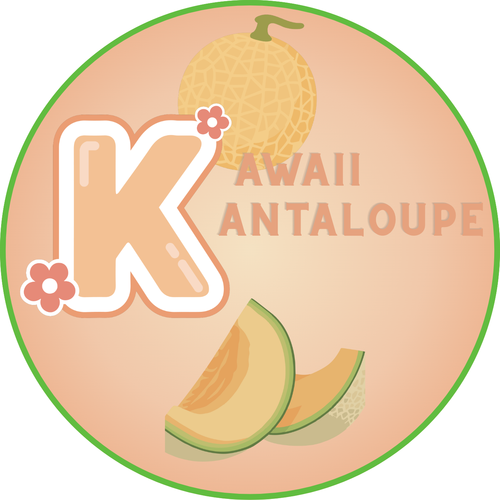

# Kawaii Kantaloupe 🍈

A kawaii-themed e-commerce website for selling handmade blob stickers, taba squishies, and slime - created by an 11-year-old entrepreneur!



## Features

- **Product Catalog**: Browse blob stickers, taba squishies, and slime
- **Shopping Cart**: Add, remove, and update quantities with localStorage persistence
- **Package Deals**: Bundle products with automatic discount pricing
- **Checkout System**: Customer information form with order processing
- **Order Confirmation**: Beautiful confirmation page with order details
- **Email Integration**: Optional EmailJS integration for order confirmations
- **Responsive Design**: Works perfectly on mobile, tablet, and desktop
- **Kawaii Aesthetic**: Cute design with pastel colors and decorative blobs

## Tech Stack

- **Framework**: Next.js 16 (App Router)
- **Language**: TypeScript
- **Styling**: Tailwind CSS
- **State Management**: React Context API
- **Email Service**: EmailJS (optional)
- **Storage**: localStorage for cart and order persistence

## Getting Started

### Prerequisites

- Node.js 18+ installed
- npm or yarn package manager

### Installation

1. Clone or download this repository

2. Install dependencies:
```bash
cd kawaii-kantelope
npm install
```

3. Run the development server:
```bash
npm run dev
```

4. Open [http://localhost:3000](http://localhost:3000) in your browser

## Project Structure

```
kawaii-kantelope/
├── app/                      # Next.js app router pages
│   ├── cart/                 # Shopping cart page
│   ├── checkout/             # Checkout form page
│   ├── confirmation/         # Order confirmation page
│   ├── packages/             # Package deals page
│   ├── shop/                 # Product catalog page
│   ├── layout.tsx            # Root layout with navigation
│   ├── page.tsx              # Home page
│   └── globals.css           # Global styles
├── components/               # Reusable React components
│   ├── BlobDecoration.tsx    # Decorative blob component
│   ├── Button.tsx            # Custom button component
│   ├── Card.tsx              # Card wrapper component
│   ├── Navigation.tsx        # Side navigation with mobile menu
│   ├── PackageCard.tsx       # Package deal product card
│   └── ProductCard.tsx       # Individual product card
├── context/                  # React context providers
│   └── CartContext.tsx       # Shopping cart state management
├── data/                     # Product and content data
│   └── products.ts           # Product catalog and decoration blobs
├── types/                    # TypeScript type definitions
│   └── index.ts              # Shared types
├── utils/                    # Utility functions
│   └── emailService.ts       # EmailJS integration
└── public/                   # Static assets
    └── images/               # Product images and logo
```

## Product Management

### Current Products

**Blob Stickers** ($3.00 each):
- Frankenstein Blob
- Witch Blob
- Pumpkin Patch Blob

**Package Deals**:
- All Blob Stickers Bundle: $8.00 (Save $1.00!)

**Coming Soon** (Placeholder):
- Taba Squishies
- Slime

### Adding New Products

Edit `data/products.ts`:

```typescript
export const blobStickers: Product[] = [
  {
    id: 'unique-id',
    name: 'Product Name',
    description: 'Product description',
    price: 3.00,
    category: 'blob-sticker',
    image: '/images/your-image.jpg',
    inStock: true,
  },
  // ... more products
];
```

### Adding Product Images

1. Place product images in `public/images/`
2. Reference them in product data: `/images/filename.jpg`
3. Supported formats: JPG, PNG, WebP

## Email Notifications (Optional)

The site includes optional EmailJS integration for sending order confirmation emails.

### Setup EmailJS

1. Create a free account at [EmailJS.com](https://www.emailjs.com/)
2. Set up an email service and template
3. Create a `.env.local` file in the project root:

```env
NEXT_PUBLIC_EMAILJS_SERVICE_ID=your_service_id
NEXT_PUBLIC_EMAILJS_TEMPLATE_ID=your_template_id
NEXT_PUBLIC_EMAILJS_PUBLIC_KEY=your_public_key
```

4. See [EMAILJS_SETUP.md](EMAILJS_SETUP.md) for detailed instructions

**Note**: The website works perfectly without EmailJS configured - orders will still process, but customers won't receive automatic email confirmations.

## Features Guide

### Shopping Cart

- Persists across page refreshes (localStorage)
- Shows item count badge in navigation
- Update quantities with +/- buttons
- Remove items individually
- View subtotal and total

### Checkout Process

1. Add items to cart
2. Review cart and quantities
3. Click "Proceed to Checkout"
4. Fill out shipping information form
5. Submit order
6. View order confirmation page

### Package Deals

- Bundle products with automatic discounts
- Shows original price vs. bundle price
- Lists all included items
- Same checkout process as individual items

## Customization

### Colors

Edit `app/globals.css` to change the color scheme:

```css
:root {
  --peach: #FFB8A3;
  --green: #7FD99F;
  --pink: #FFB3D9;
  /* ... more colors */
}
```

### Logo

Replace `public/images/Kawaii_Kantaloupe_transparent_1.png` with your own logo (PNG format recommended)

### Styling

The project uses Tailwind CSS. Customize styles by:
- Editing component className attributes
- Modifying `globals.css`
- Updating Tailwind configuration (if needed)

## Deployment

### Deploy to Vercel (Recommended)

1. Push your code to GitHub
2. Import project at [vercel.com](https://vercel.com)
3. Add environment variables (if using EmailJS)
4. Deploy!

### Other Platforms

The site can be deployed to any platform that supports Next.js:
- Netlify
- AWS Amplify
- Digital Ocean
- Self-hosted with Node.js

See [Next.js deployment docs](https://nextjs.org/docs/app/building-your-application/deploying) for more options.

## Browser Support

- Chrome (latest)
- Firefox (latest)
- Safari (latest)
- Edge (latest)
- Mobile browsers (iOS Safari, Chrome Mobile)

## Contributing

This is a personal project for a young entrepreneur. If you'd like to suggest improvements, feel free to:
- Open an issue
- Submit a pull request
- Share feedback

## License

This project is created for Kawaii Kantaloupe. All product images and branding are property of the creator.

## Support

For questions or issues:
- Check [EMAILJS_SETUP.md](EMAILJS_SETUP.md) for email setup help
- Review the code comments
- Check Next.js documentation at [nextjs.org/docs](https://nextjs.org/docs)

## Credits

- Built with [Next.js](https://nextjs.org/)
- Styled with [Tailwind CSS](https://tailwindcss.com/)
- Emails powered by [EmailJS](https://www.emailjs.com/)
- Created with love by an 11-year-old entrepreneur! 💕

---

Made with 🎨 and ✨ for Kawaii Kantaloupe
